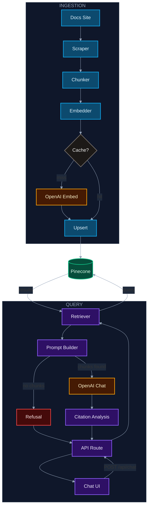

# Friday Doc Assistant

A grounded documentation assistant built over [Friday's public docs](https://www.codewithfriday.com/docs). Ask a question, get an answer backed by real sources — every factual claim is cited with a link to the relevant doc page.

For full project spec and architecture decisions, see [`SPEC.md`](./SPEC.md).

---

## How it works

```
Docs site → scrape → chunk → embed → Pinecone
                                          ↓
                          User question → embed → retrieve top-K chunks
                                                        ↓
                                              Assemble prompt → OpenAI
                                                        ↓
                                              Answer with citations → UI
```

### Layers

| Layer | Location | Description |
|---|---|---|
| **Ingestion** | `scripts/` | Scrape, chunk, embed, and upsert docs to Pinecone |
| **Shared utilities** | `src/lib/` | Env validation, OpenAI client, Pinecone client, embeddings, shared types |

---

## Architecture



### 1. Scraper

`scripts/scrape.ts` crawls the docs site starting from `DOCS_BASE_URL`. It uses Cheerio to parse HTML server-side — no headless browser required.

The scraper discovers pages by finding all `nav a[href^='/docs']` links on the index page, then fetches each one in sequence with a 300ms delay between requests. For each page it extracts `h1`, `h2`, `h3`, `p`, `li`, `pre`, and `blockquote` elements from the main content area, grouping them into sections by heading boundary.

Each page is stored as a `ScrapedPage`:

```ts
interface ScrapedPage {
  url: string;
  title: string;
  sections: { heading: string; text: string }[];
  scrapedAt: string;
}
```

---

### 2. Chunker

`src/lib/ingest-utils.ts` converts scraped pages into flat, retrievable chunks. Each section becomes at least one chunk. Sections longer than ~600 tokens are split further using a sliding window with ~80 tokens of overlap between adjacent chunks, preserving context across boundaries.

Each chunk gets a deterministic SHA-256 ID derived from its URL, heading, and text — meaning the same content always produces the same ID, enabling stable citations and safe re-ingestion. The `Chunk` type is defined in `src/lib/types.ts`:

```ts
interface Chunk {
  id: string;           // sha256(url + heading + text)
  text: string;
  url: string;
  title: string;
  headings: string[];
  chunk_index: number;
  content_hash: string; // sha256(text)
  created_at: string;
}
```

Example chunk:

```json
{
  "id": "a3f2c1d8e4b7...",
  "text": "To install the Friday CLI, run npm install -g friday-cli. Once installed, authenticate with friday login and follow the prompts.",
  "url": "https://www.codewithfriday.com/docs/getting-started",
  "title": "Getting Started",
  "headings": ["Installation"],
  "chunk_index": 0,
  "content_hash": "b7e4d29f1c3a...",
  "created_at": "2026-02-27T00:00:00.000Z"
}
```

---

### 3. Embedder

`src/lib/embeddings.ts` converts chunks into vectors using OpenAI's `text-embedding-3-small` model. The text sent to the API is a concatenation of the chunk's title, headings, and body text:

```ts
function makeEmbedText(chunk: Chunk): string {
  return [chunk.title, (chunk.headings ?? []).join("\n"), chunk.text]
    .filter(Boolean)
    .join("\n");
}
```

**Caching**

To avoid re-embedding unchanged content, the embedder maintains a file-based JSON cache at `data/embeddings-cache.json`. Each entry is keyed by a hash of the model name and the embed text:

```ts
function cacheKey(model: string, chunk: Chunk): string {
  const hash = createHash("sha256").update(makeEmbedText(chunk)).digest("hex");
  return `${model}:${hash}`;
}
```

Before calling the API, the embedder filters out any chunks already present in the cache. After the API responds, new embeddings are written back to the cache file. On subsequent runs, unchanged chunks are served entirely from disk with no API call needed.

The embedder also handles rate limits and transient errors with exponential backoff (up to 5 retries, capped at 30 seconds), and uses a concurrency semaphore to limit parallel API requests.

---

### 4. Upsert

The upsert step reads `data/embedded_chunks.json` and writes each vector to Pinecone along with its full metadata payload. The metadata stored alongside each vector mirrors the `EmbeddedChunk` fields (minus the raw `embedding` vector) — `text`, `url`, `title`, `headings`, `chunk_index`, `content_hash`, `created_at`, and `embedding_model` — so the retriever can reconstruct a complete `RetrievedChunk` from Pinecone's response without a secondary lookup.

Because chunk IDs are deterministic, re-running the upsert with the same content is safe — Pinecone overwrites existing vectors with the same ID rather than creating duplicates.

---

### 5. Retriever

`src/lib/retriever.ts` handles query-time retrieval. It embeds the user's question using the same `text-embedding-3-small` model, then queries Pinecone for the `topK` most similar vectors:

```ts
const { data } = await openai.embeddings.create({ model, input: question });
const vector = data[0].embedding;

const result = await pineconeIndex().query({ vector, topK, includeMetadata: true });
```

Each match is validated against the expected metadata shape before being returned as a `RetrievedChunk`. Matches with missing or malformed metadata are silently dropped.

The retriever is wrapped with LangSmith's `traceable` so every retrieval call is logged as a `retriever` span in the trace.

---

### 6. Prompt

`src/lib/prompt.ts` assembles the messages sent to the chat model.

**System prompt**

The system prompt constrains the model to answer only from the provided documentation snippets, cite sources inline using `[src:ID]` markers, and respond with an exact refusal phrase when the documentation doesn't contain enough information:

```
You are a documentation assistant. Answer questions using ONLY the documentation snippets provided in the user message.
If the documentation does not contain enough information to answer, respond with exactly: I cannot answer from the provided documentation.
Cite sources inline using the format [src:ID] immediately after the statement they support, where ID is the snippet ID.
Do not fabricate information or cite sources not present in the provided snippets.
```

**User prompt**

The user message is assembled from the question and the retrieved chunks. Each chunk is formatted as a labeled block:

```
Question: How do I install the Friday CLI?

Documentation:
[src:a3f2c1d8e4b7...]
Title: Getting Started
URL: https://www.codewithfriday.com/docs/getting-started
Headings: Installation
Text: To install the Friday CLI, run npm install -g friday-cli...
```

If no chunks were retrieved, the documentation block is replaced with `(no documentation provided)`, which is designed to trigger the refusal phrase from the model.

---

### 7. API Route

`src/app/api/chat/route.ts` is the single HTTP entry point for the chat feature.

**Request**

```
POST /api/chat
Content-Type: application/json

{ "question": "How do I install the Friday CLI?", "topK": 5 }
```

`topK` is optional and defaults to `5`. It is clamped to the range `[1, 8]` regardless of what is passed. The route delegates all RAG logic to `runRag()` in `src/lib/runRag.ts`, which sequences: retrieve → build prompt → call OpenAI → analyze citations → format sources.

**Response**

```json
{
  "answer": "To install the Friday CLI, run `npm install -g friday-cli` [1].",
  "sources": [
    {
      "index": 1,
      "title": "Getting Started",
      "url": "https://www.codewithfriday.com/docs/getting-started",
      "snippet": "To install the Friday CLI, run npm install -g friday-cli..."
    }
  ],
  "isRefusal": false,
  "traceId": "abc123..."
}
```

When `isRefusal` is `true`, `sources` is always empty. The `traceId` maps to a LangSmith trace for debugging.

---

### 8. Chat UI

`src/components/ChatInterface.tsx` is a React client component that provides the chat interface.

The user types a question into a textarea and submits with the **Ask** button or by pressing `Enter` (`Shift+Enter` inserts a newline). Each submission fires a `POST /api/chat` request. An `AbortController` is attached to every request so that if the user submits a new question before the previous one completes, the in-flight request is cancelled immediately.

Once a response arrives, the UI renders:

- **Answer** — the model's response with inline citation markers like `[1]` replacing the raw `[src:ID]` tags
- **Sources** — clickable cards showing the page title, a text snippet, and the source URL for each cited chunk
- **Outside scope banner** — shown when `isRefusal` is `true`, indicating the question fell outside the documentation
- **Trace ID** — displayed at the bottom with a one-click copy button for looking up the run in LangSmith

---

### 9. Evaluation

`scripts/eval.ts` runs a structured evaluation of the full RAG pipeline against a set of hand-authored test cases.

**Test cases**

Cases are defined in `data/eval-cases.json`:

```json
[
  {
    "id": "install-cli",
    "question": "How do I install the Friday CLI?",
    "expectedUrls": ["https://www.codewithfriday.com/docs/getting-started"],
    "expectedKeywords": ["npm install", "friday-cli"],
    "shouldRefuse": false
  }
]
```

| Field | Description |
|---|---|
| `expectedUrls` | Pages that should appear in the retrieved chunks |
| `expectedKeywords` | Words that should appear in the final answer |
| `shouldRefuse` | Whether the model is expected to issue a refusal |

**Process**

The harness uploads the cases to a LangSmith dataset named `friday-docs-eval`, then runs `evaluate()` against the full `runRag()` pipeline with `maxConcurrency: 2`. Each case is scored by five evaluators:

| Metric | Definition |
|---|---|
| `retrieval_recall` | Fraction of `expectedUrls` that appear in the retrieved chunks |
| `grounding` | `1` if zero hallucinated citations, `0` otherwise |
| `citation_precision` | `cited / (cited + hallucinated)` |
| `refusal_correctness` | `1` if `isRefusal` matches `shouldRefuse`, `0` otherwise |
| `keyword_coverage` | Fraction of `expectedKeywords` found in the answer |

Results are printed as a per-case table and aggregate averages. Full traces are available in the LangSmith UI under the `friday-docs-rag` experiment prefix.

---

## Tech stack

| Technology | Role |
|---|---|
| **Next.js (App Router)** | Full-stack framework — API routes + chat UI |
| **TypeScript** | End-to-end type safety across ingestion, retrieval, and UI |
| **OpenAI** | Embeddings (`text-embedding-3-small`) + chat completions |
| **Pinecone** | Managed vector store for similarity search |
| **Cheerio** | Server-side HTML scraping — no headless browser needed |
| **Vitest** | Unit testing |
| **LangSmith** | Trace logging and evaluation |
| **Tailwind CSS** | UI styling |

---

## Setup

### Prerequisites

- Node.js 20.9+
- A [Pinecone](https://www.pinecone.io/) account with an index created
- An [OpenAI](https://platform.openai.com/) API key
- A [LangSmith](https://smith.langchain.com/) API key (optional — for tracing)

### Install

```bash
npm install
cp .env.example .env.local
```

Fill in `.env.local`:

| Variable | Description |
|---|---|
| `DOCS_BASE_URL` | Root URL of the documentation site to scrape |
| `OPENAI_API_KEY` | OpenAI API key |
| `PINECONE_API_KEY` | Pinecone API key |
| `PINECONE_INDEX` | Name of your Pinecone index |
| `PINECONE_NAMESPACE` | Namespace within the index |
| `LANGSMITH_API_KEY` | LangSmith API key |

### Run the dev server

```bash
npm run dev
```

Open [http://localhost:3000](http://localhost:3000).

---

## Scripts

### Ingestion pipeline

Run these once (or whenever the docs change) to populate Pinecone:

```bash
npm run scrape    # Crawl the docs site → data/scraped.json
npm run ingest    # Chunk scraped pages → data/chunks.json
npm run embed     # Embed chunks via OpenAI → data/embedded_chunks.json
npm run upsert    # Upsert embedded chunks to Pinecone
```

Each step is independent — you can re-run any one without repeating the others.

### Development

```bash
npm run dev           # Start Next.js dev server at http://localhost:3000
npm run build         # Production build
npm start             # Start production server
npm run lint          # Run ESLint
```

### Testing

```bash
npm test              # Run all tests once
npm run test:watch    # Run tests in watch mode
npm run test:coverage # Run tests with coverage report
```

### Evaluation

```bash
npm run eval          # Run the evaluation harness → eval/results/
```
